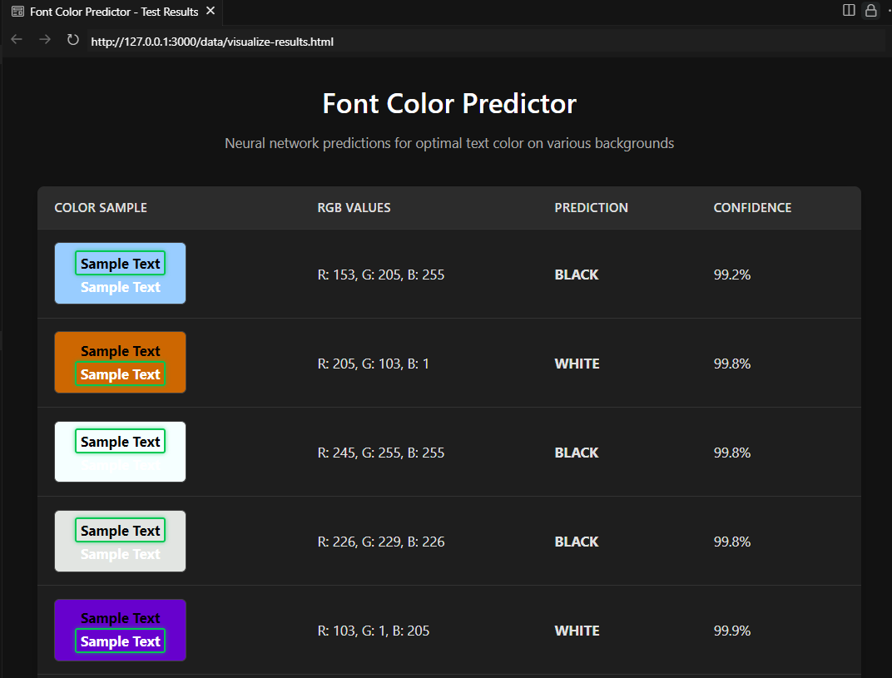

# Font Colour Predictor
This program implementa a basic multi-layer perceptron neural network from scratch, and then applies it to a novel dataset, to predict the ideal font color to display (b, w) over a given background (r, g, b).


## Build and Run

### Prerequisites
- .NET 9.0+
### Linux
```bash
chmod +x ./run.sh # make executable
./run.sh # build and run the program
```
### Windows
```bash
run.bat # build and run the program
```

## Outputs

### Architecture

### Command Line Interface
This is the cli interface as the program is run, showing basic model training and inference.

### Test Data Visualization
This is part of the randomized 25% test split from the initial training data, visualized using basic html to convey the RGB background -> B/W output characteristics.



## The Dataset - ideal B/W font colour for a given RGB background
A console application providing inference to the trained neural network is served to predict the ideal font colour (b, w) to display over any given background colour (r, g, b).

100 training samples were generated manually to train the network with. The background was defined by red, green, blue values of the range 0-255 and ideal font colour 0 for black, 1 for white.

This list of 100 entries was shuffled in excel then split into 75 lines for training data and 
25 for test data. Red, green and blue values (0-255) were normalized (0-1).

Some large errors exist due to the at times subjective nature of background / font aesthetics.


## Neural Network

This learning algorithm was created with no references to any existing Machine Learning libraries. The neural network framework
was adapted from The One on youtube - https://youtu.be/L_PByyJ9g-I.

A TanH activation function was used with a adjustable learning rate and number of feed forward / back propagation iterations.

The number of hidden layers along with neurons in each layer can be set when constructing the NeuralNetwork class. 
The ideal font colour was chosen for 100 different background colours, with effort to reduce biases across the colour 
spectrum. 

The program wraps around the neural network like this


## TODO
Adapt from Black and White font color predictor to RGB (add 1 output neuron, create new train dataset)
Create library version of neural network for web integration 
- Create clean API for font color prediction (single method call)
- Build WASM wrapper for JavaScript/TypeScript consumption
- Create example JSX/TSX component for dynamic text styling based on background

this might be overkill if it can be done deterministically from the color wheel